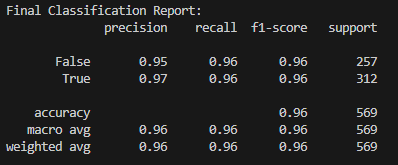
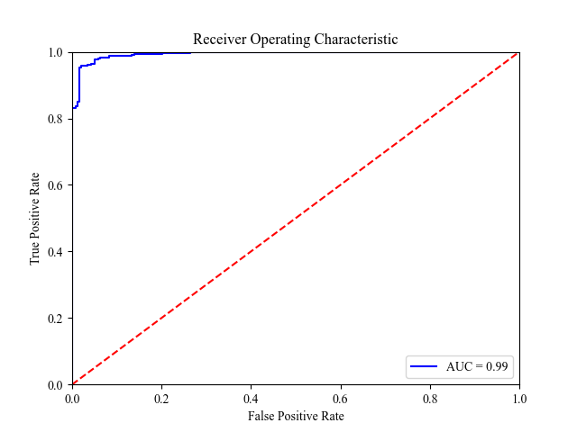
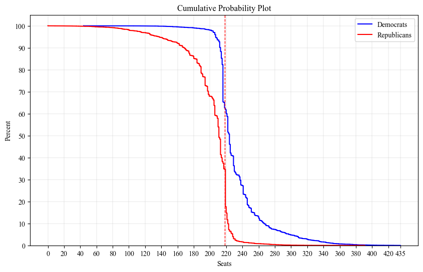
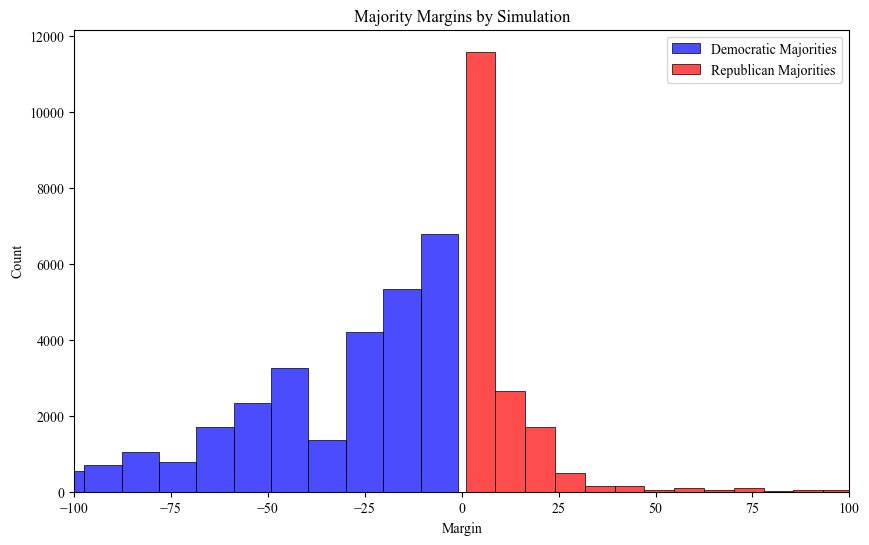

# DS496 Senior Capstone Project, Finley Costello
## U.S. House Election Model
This is a machine-learning model with the goal of correctly predicting which party will win elections to the house of representatives. Given the erratic nature of polling in the Trump era, the model only uses data on the "fundamentals" of each house district: demographic data, partisanship, and political context (Whether the election is a midterm, the party of the president, and the party of the incumbent).

## Data Sources
Census ACS Data (2012, 2013, 2015, 2017, 2019, 2022, and 2023)

MIT Election Lab, U.S. House Election Results 1976-2022

Cook Political Report, Cook PVI 1997-2025

## Final Dataset
Our final datset contains all U.S. House elections from 2012 to 2024, including the following features:

1. Year of election
2. State
3. District #
4. Median age of congressional district
5. College Graduate % of congressional district
6. White % of congressional district
7. Black % of congressional district
8. Hispanic % of congressional district
9. Asian % of congressional district
10. Native American % of congressional district
11. Cook PVI of congressional district
12. Party of incumbent
13. Party of the President
14. Election cycle (Midterm or Presidential)
15. Party of the winner (class label)

## Model Selection
Using SKLearn, we will construct pipelines to scale our data then conduct a grid search with k-fold cross validation to find the best hyperparameters. We will test Logistic Regression, SVM, and Random Forest models, picking models with the best F1 scores on our validation data and ensuring they aren't overfitting to training data. 

## Final Model
With consistent validation/training F1 scores of 0.96, we will be using logistic regression with hyperparameters:
> {'lr__C': 10, 'lr__max_iter': 100, 'lr__solver': 'lbfgs'}

## Model Evalutaion

As we can see, the model performed very well! We achieved a final accuracy, precision, recall, and F1 of 0.96. Focusing on accuracy, this equates to missing around 17 elections per cycle. Given similar performance on training and validation data, there's little evidence of overfitting. 

## 2026 Predictions
Now let's see the model in action, what does it have to say about the 2026 Midterms?

After using our outputted model probabilities to run 100000 simulations, Democrats have a 65.13% chance of flipping the house, Republicans have a 34.87% chance of holding it.

This plot shows the likelihood of each party receiving a certain number of seats or more. For example, Democrats have around a 40% chance of holding over 230 seats, while the same threshold is around 5% for Republicans. 

This plot shows the distribution of congressional majorities in our simulations. We can see that the most frequent simulated outcome was a slight Republican of majority of around 5 seats. Democrats have a much higher ceiling however, and because so many Republican incumbents are on defense, Democrats have strong odds to re-take the house.

Overall I feel these predictions are accurate, 2/3 odds is fair for Democrats and probably lower than what early betting markets will open at. However, it is incredibly bullish on Democratic incumbents (it views 0 as being vulnerable in 2026), and while opposition incumbents rarely lose in Midterms, I still think this is a tad too agressive.